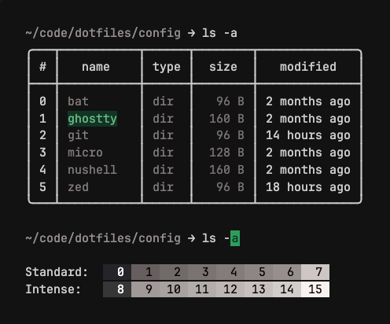
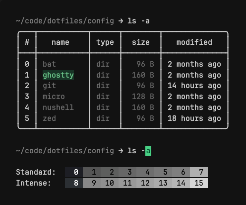
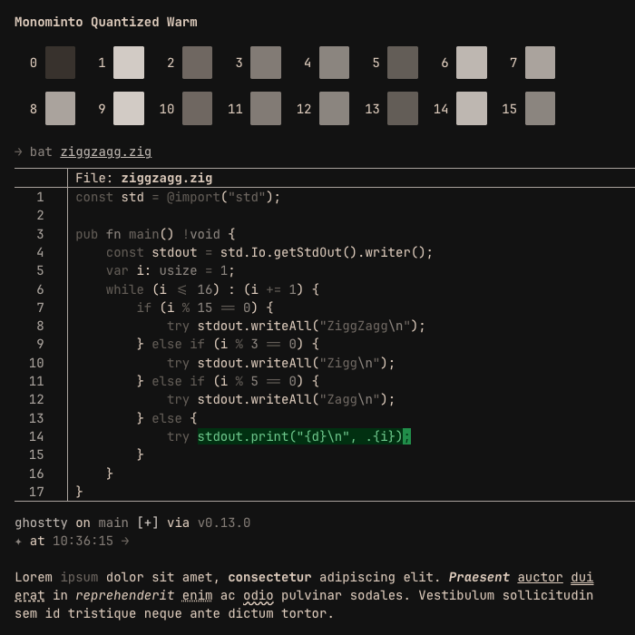
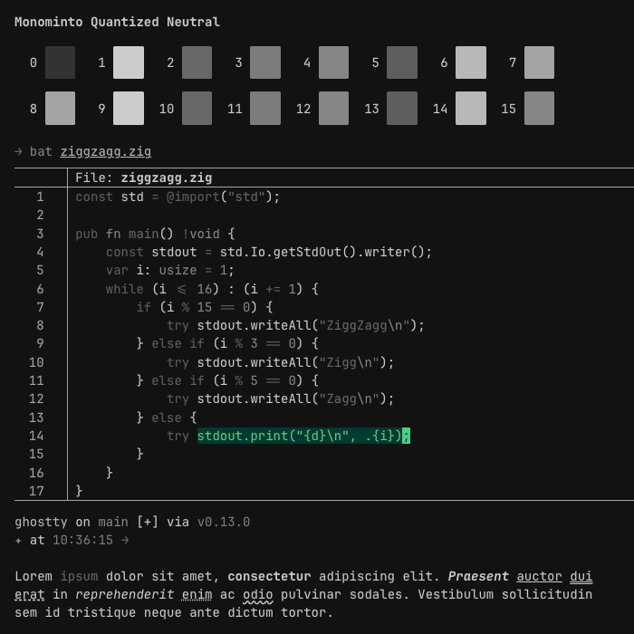
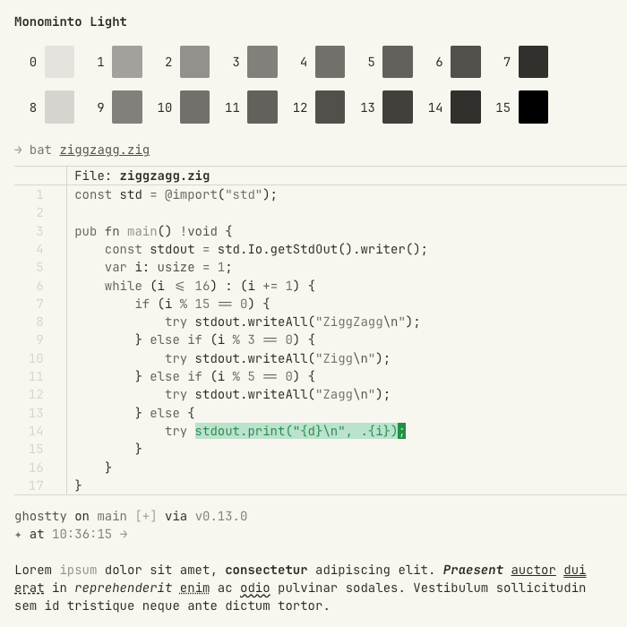
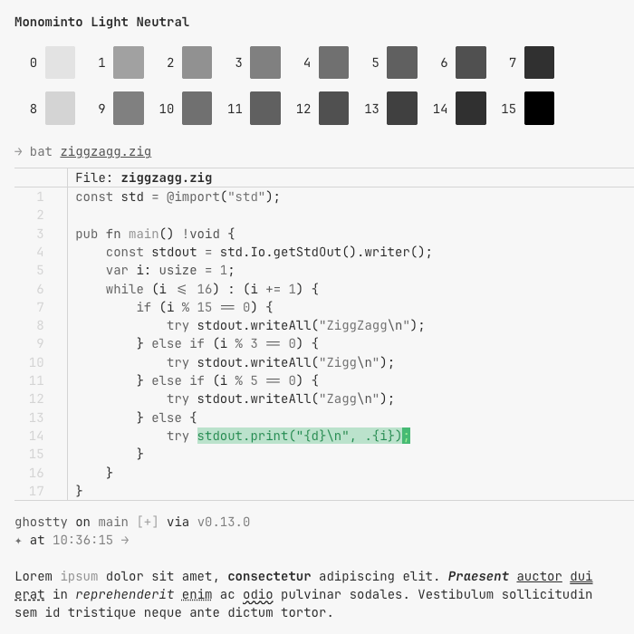

# Themes for Ghostty

## Monominto

Conservative monochrome-ish themes, with a slight accent for cursor and selection.

**Monominto Warm** &middot; [Download](ghostty/monominto/monominto-warm.conf)

**Monominto Neutral** &middot; [Download](ghostty/monominto/monominto-neutral.conf)

**Monominto Quantized Warm** &middot; [Download](ghostty/monominto/monominto-quantized-warm.conf)

**Monominto Quantized Neutral** &middot; [Download](ghostty/monominto/monominto-quantized-neutral.conf) (Based on the lovely [e-ink theme](https://github.com/e-ink-colorscheme/e-ink.ghostty) by Algilbert Gomez.)

**Monominto Light Warm** &middot; [Download](ghostty/monominto/monominto-light-warm.conf)

**Monominto Light Neutral** &middot; [Download](ghostty/monominto/monominto-light-neutral.conf)

